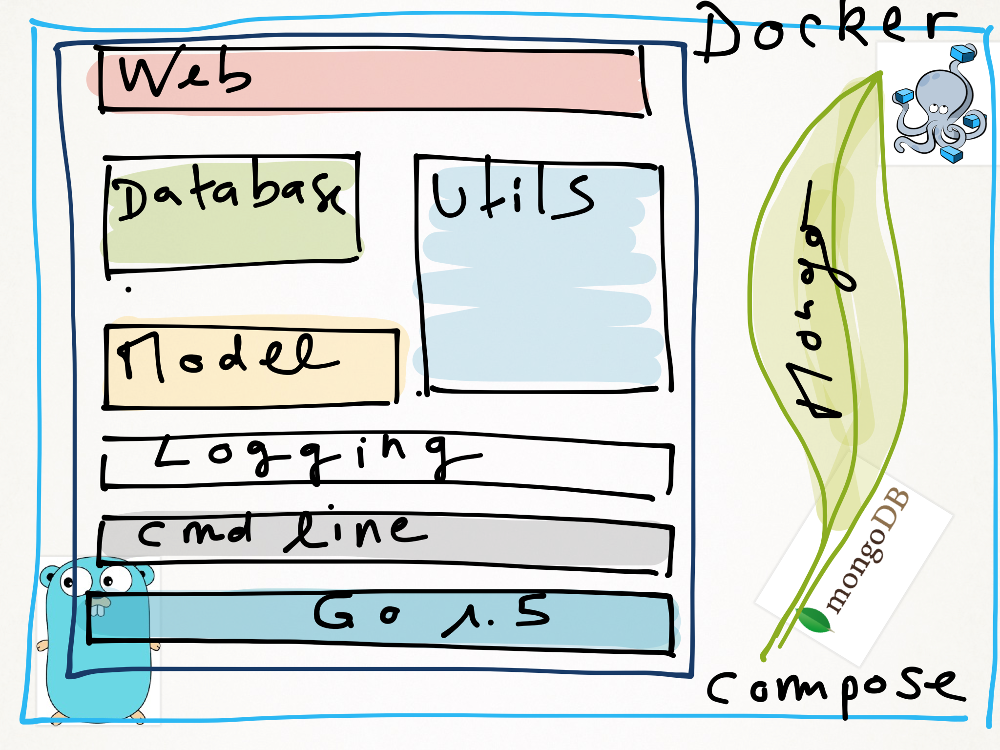
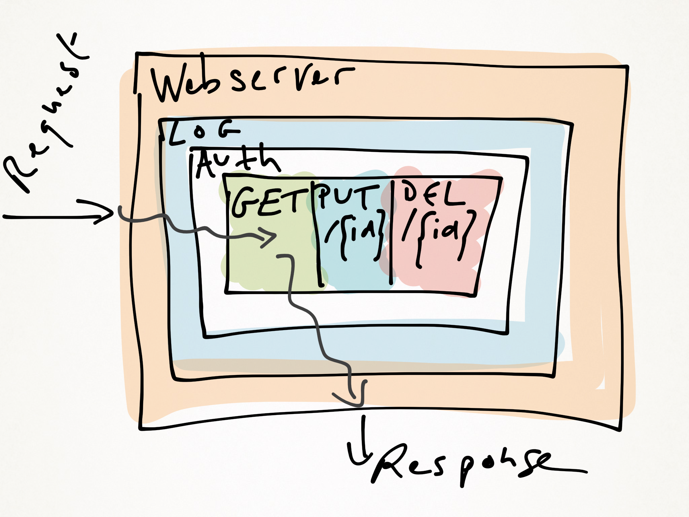

#HANDSONGO
[](https://travis-ci.org/sebastienfr/handsongo)
[](https://godoc.org/github.com/sebastienfr/handsongo)
[](https://codebeat.co/projects/github-com-sebastienfr-handsongo)
[](https://github.com/sebastienfr/handsongo/blob/master/LICENSE)

This project is meant to help learning go. It provides a basic implementation of a REST microservice exposing a CRUD API.
Data are persisted in a MongoDB NoSQL database and the application is deployed in Docker.

## Technical stack

* [Docker](https://www.docker.com)
* [MongoDB NoSQL database](https://www.mongodb.com)
* [Go is the language](https://golang.org)
* [Gorilla Mux the URL router](https://github.com/gorilla/mux)
* [Gorilla Mux the request context manager](https://github.com/gorilla/context)
* [Urfave negroni Web HTTP middleware](https://github.com/urfave/negroni)
* [Urfave cli the command line client parser](https://github.com/urfave/cli)
* [Sirupsen the logger](https://github.com/Sirupsen/logrus)
* [The database driver](https://gopkg.in/mgo.v2)
* [Godep the dependency manager](https://github.com/tools/godep)
* [Golint the source linter](https://github.com/golang/lint/golint)

## Architecture





## Build

```shell
make help
```
